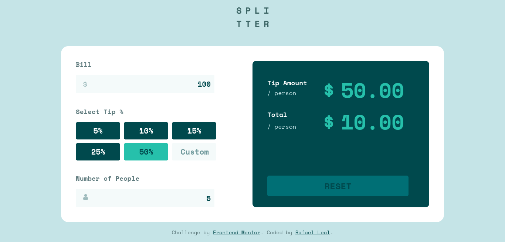

# Frontend Mentor - Tips Calculator

This is a solution to the Tips Calculator from FrontEndMentor

## Table of contents

- [Overview](#overview)
  - [The challenge](#the-challenge)
  - [Screenshot](#screenshot)
  - [Links](#links)
- [My process](#my-process)
  - [Built with](#built-with)
  - [What I learned](#what-i-learned)
- [Author](#author)

## Overview

### The challenge

Users should be able to:

- View the optimal layout for the site depending on their device's screen size
- See hover states for all interactive elements on the page

### Screenshots

 

### Links

- [Solution](https://github.com/RafaelGLeal/Tips-Calculator/)

## My process

### Built with

- Semantic HTML5 markup
- CSS custom properties
- Flexbox
- CSS Grid
- Sass preprocessor
- Javascript

### What I learned

It was really challenge to automatic update the user inputs to Dom to make a interactive app with javascript.

## Author

- Website - [Rafael Leal](https://github.com/RafaelGLeal)
- Frontend Mentor - [@rafaelGleal](https://www.frontendmentor.io/profile/rafaelGleal)
